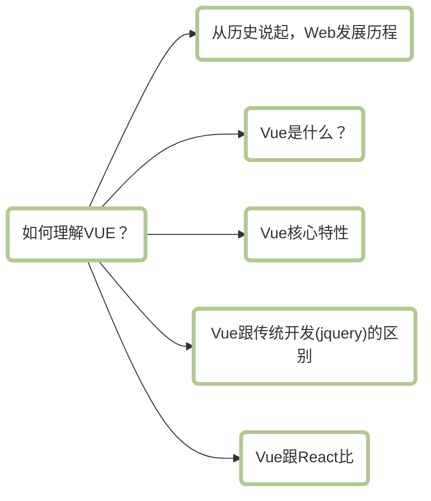
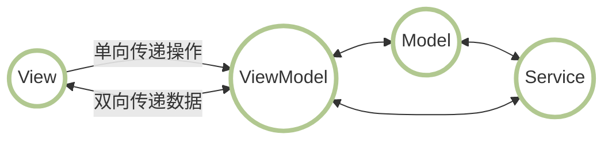
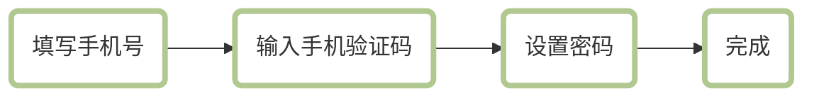

## for in、Object.keys、Object.hasOwnPropertyName、Reflect.ownKeys之间的区别
1. for in：
+ 遍历对象和其原型链上的可枚举属性。
+ 遍历数组时，除遍历其元素外，还会遍历开发着对数组对象自定义的和数组原型链上的可枚举属性。
+ 遍历对象返回的属性名和遍历数组返回的索引都是string类型。
+ 某些情况下，可能按随机顺序遍历数组。

2. Object.keys：
+ 返回对象自身可枚举属性组成的数组。
+ 不会遍历对象原型链上的属性以及Symbol属性。
+ 对数组的遍历顺序和for in一样。

3. Object.getOwnPropertyNames：
返回一个由指定对象所有自身属性（包含不可枚举属性但不包含Symbol作为属性名的属性）组成的数组

4. Relect.ownKeys返回对象自身属性名（包含不可枚举属性和Symbol作为属性名的属性）组成的数组。等同于Object.getOwnPropertyNames + Object.getOwnPropertySymbols。

## 判断数组
1. `[] instanceof Array`
2. `Object.prototype.toString.call([]) === Array`
3. `Array.isArray([])`
4. `Array.prototype.isPrototypeOf([])`
5. `Object.getPrototypeOf([]) === Array.prototype`
6. `[].constructor === Array

## 如何理解Vue

#### 一、web发展历史
Web是World Wide Web的简称，中文译为万维网

我们可以将它规划成如下的几个时代来进行理解
+ 石器时代
+ 文明时代
+ 工业革命时代
+ 百花齐放时代

###### 石器时代指的就是我们的静态网页
最早的网页是没有数据库的，可以理解成就是一张可以在网络上浏览的报纸，直到CGI技术的出现，通过CGI Perl运行一小段代码与数据库或文件系统进行交互，如当时的Google（1998）年。

###### 文明时代
2005年左右，先后出现了ASP、JSP技术，增强了web与服务端交互的安全性。JSP其实就是Java + HTML。

JSP又一个缺点，就是不太灵活，因为JSP是在服务端执行的，返回的就是一段HTML文本，我们每次的请求（获取的数据、内容的加载），都是服务器为我们返回渲染之后的DOM，这也就使我们开发网站的灵活度大打折扣。

在这种情况下，同年Ajax火了。

###### 工业革命时代
到这里大家就熟悉了。

移动设备的普及，jquery的出现，以及SPA的雏形，Angularjs这样一批前端框架随之出现，但当时SPA的路不好走，例如SEO问题，SPA过多的页面，复杂场景下View的绑定等，都没有很好的处理。

这几年的飞速发展，节约了开发人员大量的精力，降低了开发着和开发过程的门槛，极大提升了开发效率和迭代速度，我们可以称之为工业时代。

###### 百花齐放时代
Vue、React、Angular等等。

#### 二、Vue是什么
Vue是一个用于创建用户界面的开源Javascript框架，也是一个创建单页应用的Web应用框架，同时也是一款流行的Javascript前端框架，旨在更好地组织与简化Web开发。Vue所关注的核心是MVC中的视图层，同时，他也能方便地获取数据更新，并通过组建内部特定的方法实现视图与模型的交互。

#### 三、Vue的核心特性
###### 数据驱动（MVVM）
MVVM表示的是Model-View-ViewModel
+ Model：模型层，负责处理业务逻辑以及和服务器端进行交互
+ View：视图层，负责将数据模型转化为UI展示出来，可以简单的理解为HTML
+ ViewModel：视图模型层，用来连接Model和View，是Model和View之间的通信桥梁

###### 组件化
1. 什么是组件化？
一句话来说就是把图形、非图形的各种逻辑均抽象为一个统一的概念（组件）来实现开发的模式。在Vue中每一个`.vue`文件都可以视为一个组件。

2. 组件化的优势
+ 降低整个系统的耦合度，在保持接口不变的情况下，我们可以替换不同的组件快速完成需求。例如输入框，可以替换为日历、时间、范围等组件作具体的实现。

+ 调试方便，整个系统是通过组建组合起来的，在出现问题的时候，可以用排除法直接移除组件，或者根据报错的组件快速定位问题，之所以能够快速定位，是因为每个组建之间低耦合，职责单一，所以逻辑会比分析整个系统简单。

+ 提高可维护性，由于每个组件的职责单一，并且组件在系统中是被复用的，所以对代码进行优化可获得系统的整体升级。

###### 指令系统
解释：指令是带有`v-`前缀的特殊属性
作用：当表达式的值改变时，将其产生的连带影响，响应式的作用于DOM。

常用的指令：
+ 条件渲染指令`v-if`
+ 列表渲染指令`v-for`
+ 属性绑定指令`v-bind`
+ 事件绑定指令`v-on`
+ 双向数据绑定指令`v-model`

#### 四、Vue跟传统开发的区别
没有落地使用场景的革命不是好革命，就以一个高频的应用场景来示意吧

注册账号这个需求大家应该很熟悉了，如下：

用jquery来实现大概的思路就是选择流程DOM对象，点击按钮隐藏当前活动流程DOM对象，显示下一流程DOM对象。

用Vue来实现，我们知道Vue基本不操作DOM节点，双向绑定使DOM节点跟视图绑定后，通过修改变量的值控制DOM节点的各类属性。

总结就是：
+ Vue的所有界面事件，都是只去操作数据的，jquery操作DOM。
+ Vue的所有界面的变动，都是根据数据自动绑定出来的，jquery操作DOM。

#### 五、Vue和React对比
这里就做几个简单的类比吧，当然没有好坏之分，只是使用场景不同。

相同点：
+ 都有组件化思想
+ 都支持服务端渲染
+ 都有Virtual DOM（虚拟DOM）
+ 数据驱动视图
+ 都有支持native的方案：Vue的weex，React的React native
+ 都有自己的构建工具，Vue的Vue-cli，React的Create React App

区别：
+ 数据变化的实现原理不同，react使用的是不可变数据，而Vue使用的是可变的数据
+ 组件化通信的不同，react中我们通过使用回调函数来进行通信的，而Vue中子组件向父组件传递消息有两种方式：事件和回调函数。
+ diff算法不同，react主要使用diff队列保存需要更新哪些DOM，得到patch树，再统一操作批量更新DOM，Vue使用双向指针，边对比边更新DOM。

## 使用float布局容易产生什么问题，解决方式呢？
+ 子元素在设置float后，会脱离文档流，造成父元素高度塌陷

解决方式：
+ 父元素设置高度
+ 清除浮动

## HTTPS是什么？
HTTPS即加密的HTTP，HTTPS并不是一个新协议，而是HTTP+SSL（TLS）。原本HTTP先和TCP（假定传输层是TCP协议）直接通信，而加了SSL后，就变成了HTTP先和SSL通信，再由SSL和TCP通信，相当于SSL被嵌在了HTTP和TCP之间。

## 介绍几种常见的状态码
2XX系列：代表请求已经成功被服务器接收、理解并接受。

200：表示请求已经成功，请求所希望的响应头或数据体将随此响应返回

201：表示请求成功并且服务器创建了新的资源，且其URI已经随Location返回

3XX系列：代表需要客户端采取进一步的操作才能完成请求，这些状态码用来重定向，后续的请求地址在本次响应的Location域中指明。

301：被请求的资源已永久移动到新位置

302：请求的资源临时从不同的URI响应请求

304：自动上次请求后，请求的网页未修改过，服务器返回此响应时，不会返回网页内容。

4xx系列：表示请求错误，代表了客户端看起来可能发生了错误，妨碍了服务器的处理

401：请求要求身份验证，对于需要登录的网页，服务器可能返回此响应

403：服务器已经理解请求，但拒绝执行他，与401响应不同的是，身份验证并不能提供任何帮助，而且这个请求也不应该被重复提交。

404：请求失败，请求所希望得到的资源未被在服务器上发现

5xx系列：代表了服务器在处理请求的过程中有错误或者异常状态发生，也有可能是服务器意识到以当前的软硬件资源无法完成对请求的处理。

500：服务器遇到了一个未曾预料的情况，导致了他无法完成对请求的处理

503：由于临时的服务器维护或过载，服务器当前无法处理请求

## 闭包是什么？
闭包就是能够读取其他函数内部变量的函数

## NaN是什么？
表示`Not a Number`  
typeof NaN == 'number'
